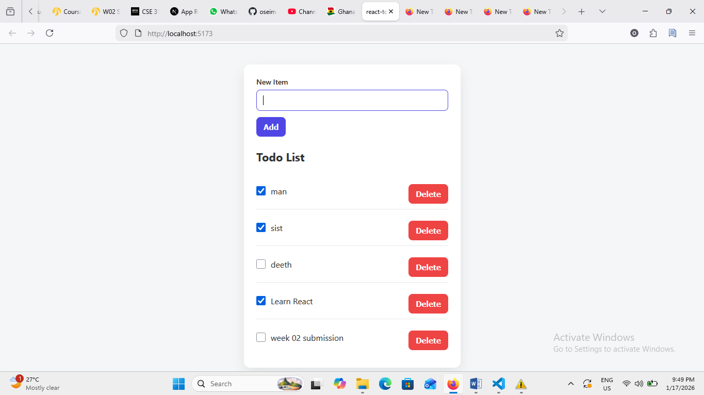

# React Todo List

A simple and functional **Todo List application built with React and Vite**.

This project allows users to:
- Add new tasks
- Mark tasks as completed
- Delete tasks
- Persist tasks using **localStorage**

---

## 🎥 Demo Video

You can watch my project demo and code walkthrough here:

👉 **[View Loom Video](https://www.loom.com/share/0238142c02d343ae87b945d9ddae9d88)**

## 🚀 How to Run the Project

1. Install dependencies:

   ```bash
   npm install

    Start the development server:

npm run dev

Open your browser and visit:

    http://localhost:5173

📦 Project Structure

src/
 ┣ App.jsx
 ┣ NewTodoForm.jsx
 ┣ TodoItem.jsx
 ┣ TodoList.jsx
 ┗ style.css

🧠 What I Learned

Through this project, I learned:

    How to manage state using React Hooks (useState, useEffect)

    How to pass data between components using props

    How to implement persistent data storage with localStorage

    How to structure and document a small React application

🕒 Time Spent

Total time spent on this project during this sprint: 21 hours
📸 Screenshot


👤 Author

Osei Mac-Donald Bonsu